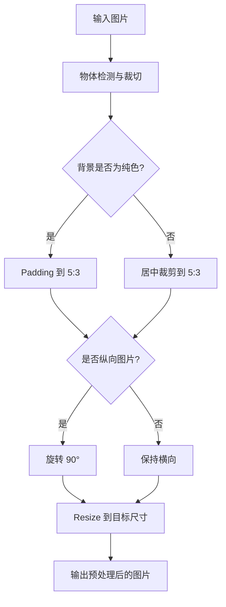
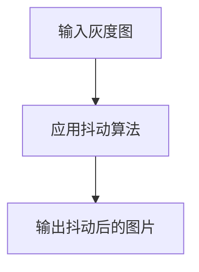
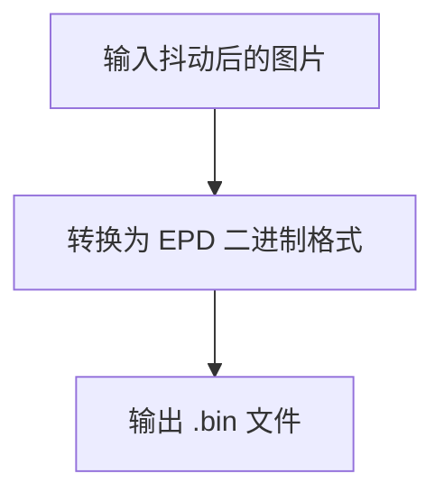

# E-Ink Image Processor (geink)

一个用于电子墨水屏图片预处理、抖动和格式转换的命令行工具。

## 功能模块 (Commands)

`geink` 工具提供以下子命令，每个子命令负责处理图像的不同阶段：

### 1. `preprocess` - 图像预处理
负责将输入图片进行物体检测、智能裁切、背景处理、方向处理和 Resize 到指定尺寸。

**处理流程:**


### 2. `dither` - 图像抖动
对预处理后的灰度图片应用抖动算法（如 Floyd-Steinberg 或 Jarvis, Judice, Ninke），转换为多级灰度图或二值图。

**处理流程:**


### 3. `convert` - 转换为 EPD 格式
将抖动后的图片（多级灰度或二值）转换为电子墨水屏专用的原始二进制 (`.bin`) 格式。

**处理流程:**

## 使用方法

首先，安装项目依赖：
```bash
pip install -e ".[dev]"
```

`geink` 是一个命令行工具，通过子命令进行操作。

### 1. 图像预处理 (`preprocess`)
将图片预处理到目标尺寸。支持单个文件或目录批量处理。

```bash
# 处理单个文件（输出路径可选，自动生成 _crop 后缀）
geink preprocess path/to/image.jpg [output_preprocessed.png]

# 批量处理目录下所有图片
geink preprocess path/to/images/
```

### 2. 图像抖动 (`dither`)
对预处理后的图片进行抖动处理。支持单个文件或批量处理 `_crop` 图片。

```bash
# 处理单个文件（输出路径可选，自动生成 _dithered 后缀）
geink dither path/to/image_crop.png [output_dithered.png]

# 批量处理目录下所有 _crop 图片
geink dither path/to/images/
```

### 3. 转换为 EPD 格式 (`convert`)
将抖动后的图片转换为 EPD 原始二进制格式。

```bash
# 处理单个文件（输出路径可选，自动生成 .bin）
geink convert path/to/image_dithered.png [output.bin]

# 批量处理目录下所有 _dithered 图片
geink convert path/to/images/
```

## 命令行参数

### `geink preprocess` 参数

| 参数 | 默认值 | 说明 |
|------|--------|------|
| `INPUT_PATH` | (必填) | 输入图片文件或目录 |
| `OUTPUT_PATH` | (自动生成) | 输出图片文件路径，可选 |

### `geink dither` 参数

| 参数 | 默认值 | 说明 |
|------|--------|------|
| `INPUT_PATH` | (必填) | 输入 `_crop` 图片文件或目录 |
| `OUTPUT_PATH` | (自动生成) | 输出抖动后的图片文件路径，可选 |
| `--method` / `-m` | `floyd_steinberg` | 抖动算法 |

### `geink convert` 参数

| 参数 | 默认值 | 说明 |
|------|--------|------|
| `INPUT_PATH` | (必填) | 输入 `_dithered` 图片文件或目录 |
| `OUTPUT_PATH` | (自动生成) | 输出 `.bin` 文件路径，可选 |
| `--width` / `-w` | `800` | 目标宽度 |
| `--height` / `-h` | `480` | 目标高度 |
| `--color-levels` / `-c` | `2` | 颜色级别数 (2 的幂次) |
| `--espslider-dir` | `ESPSlider/` | ESPSlider 目录，自动生成 `.h` 头文件 |

### 支持的抖动算法 (`--method` 参数)

- `floyd_steinberg`: Floyd-Steinberg（默认，速度快，扩散到相邻 4 像素）
- `jarvis_judice_ninke`: Jarvis, Judice, Ninke（质量更高，扩散到相邻 12 像素）
- `stucki`: Stucki（JNN 变体，产生更平滑的结果）

## 输出格式

输出为 `.bin` 原始二进制文件，按行优先排列。每像素占用 `log2(color_levels)` 位：

| 颜色级别 | 每像素位数 | 每字节像素数 | 800×480 文件大小 |
|----------|-----------|--------------|------------------|
| 2 (1-bit) | 1 bit | 8 pixels | 48,000 bytes |
| 4 (2-bit) | 2 bits | 4 pixels | 96,000 bytes |
| 8 (3-bit) | 3 bits | ~2.67 pixels | 144,000 bytes |
| 16 (4-bit) | 4 bits | 2 pixels | 192,000 bytes |

自动生成 `.h` 头文件供 ESPSlider 使用。

---

## ESPSlider 固件烧录

ESPSlider 是运行在 ESP8266 上的电子墨水屏驱动程序，通过 Web 界面接收并显示处理后的图像。

### 编译固件

```bash
# 进入项目目录
cd ESPSlider

# 确保主文件名与目录名匹配（Arduino CLI 要求）
mv Loader.ino ESPSlider.ino

# 编译（使用 generic 板型）
arduino-cli compile --fqbn esp8266:esp8266:generic /home/guozr/CODE/gEInk/ESPSlider
```

编译成功后会生成固件文件：
- `/home/guozr/.cache/arduino/sketches/.../ESPSlider.ino.bin` - 烧录用固件
- `/home/guozr/.cache/arduino/sketches/.../ESPSlider.ino.elf` - ELF 调试文件

### 烧录固件

```bash
# 通过串口烧录（需要先连接 USB 转串口模块）
arduino-cli upload -p /dev/ttyUSB0 --fqbn esp8266:esp8266:generic /home/guozr/CODE/gEInk/ESPSlider
```

### 查看串口日志

```bash
# 115200 波特率查看启动日志
screen /dev/ttyUSB0 115200
# 或
minicom -D /dev/ttyUSB0 -b 115200
```

### 资源使用

| 资源 | 使用量 | 总量 | 占比 |
|------|--------|------|------|
| RAM (全局/静态) | 48,472 B | 80,192 B | 60% |
| IRAM (指令内存) | 60,807 B | 65,536 B | 92% |
| Flash (代码) | 304,024 B | 1,048,576 B | 28% |
