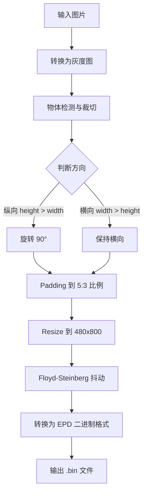

# E-Ink Image Processor

一个用于电子墨水屏图片的预处理工具，支持自动裁切、Padding、Resize 和 Floyd-Steinberg 抖动算法。

## 处理流程



## 核心步骤

### 1. 灰度转换
将 RGB 图片转换为 8 位灰度图。

### 2. 物体检测与裁切
检测图片中主体的最小边缘，进行智能裁切（当前为全图模式）。

### 3. 方向处理
- **纵向图片** (height > width): 自动旋转 90° 转为横向
- **横向图片**: 保持横向方向

### 4. Padding 到 5:3 比例
根据原图长宽比确定 Padding 方式：
- 以边缘检测的 dominant color 作为填充色
- 保持内容居中

### 5. Resize
最终尺寸：**480 x 800**（横向）

### 6. 抖动处理
使用 Floyd-Steinberg 抖动算法将灰度图转换为 1-bit 二值图。

### 7. EPD 格式转换
将像素数据打包为电子墨水屏专用的 raw binary 格式。

## 使用方法

```bash
# 安装依赖
pip install -e ".[dev]"

# 处理单张图片
python image_processor.py path/to/image.jpg --output path/to/output.bin

# 处理整个目录
python image_processor.py --input test_img --output processed_images

# 自定义尺寸
python image_processor.py image.jpg --output output.bin --width 640 --height 384
```

## 命令行参数

| 参数 | 默认值 | 说明 |
|------|--------|------|
| `--input` / `-i` | `test_img` | 输入图片目录 |
| `--output` / `-o` | `processed_images` | 输出目录 |
| `--width` / `-w` | `800` | 目标宽度 |
| `--height` / `-h` | `480` | 目标高度 |
| `--dither` / `-d` | `floyd_steinberg` | 抖动算法 |

### 支持的抖动算法

- `floyd_steinberg`: Floyd-Steinberg（默认，速度快）
- `jarvis_judice_ninke`: Jarvis, Judice, Ninke（质量更高，扩散更均匀）

## 输出格式

输出为 `.bin` 原始二进制文件，每像素 1 bit，按行优先排列。
文件大小计算：`width × height ÷ 8` bytes

例如 800×480 的图片输出文件大小为 48,000 bytes。
